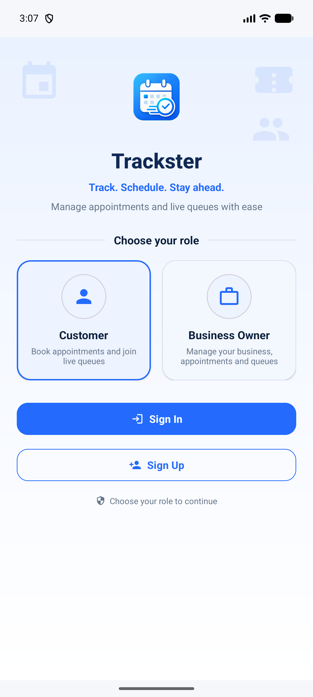
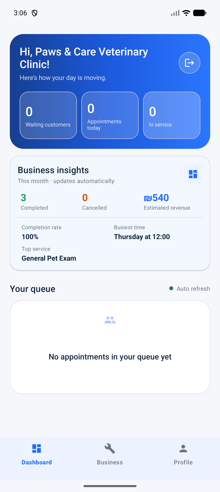
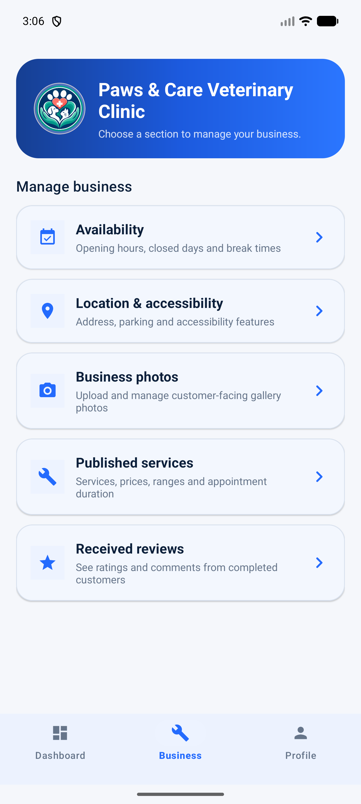

# Trackster

Trackster is an Android/Kotlin appointment and live-queue app for local service businesses. Customers discover registered businesses, book a service, and track their position in real time. Business owners publish services, see their queue, call the next customer, and complete appointments.

The app keeps the visual direction from the approved project proposal: a bright blue Trackster identity, generous spacing, rounded Material cards, clear status colors, and simple role-based navigation.

## App preview

| Welcome and role selection | Business dashboard | Business management |
| --- | --- | --- |
|  |  |  |

## Firebase setup

The Android package is `com.Khalil.trackster`. The private `app/google-services.json` file is intentionally excluded from this public repository. To build the project, create your own Firebase Android app with the same package name, download its `google-services.json`, and place it in the `app/` directory.

The repository includes the Firestore indexes and role-aware Firestore and Storage rules. The rules use authenticated user IDs and document ownership checks; no private account IDs or credentials are stored in the repository.

If the Firebase CLI is installed and authenticated, deploy the rules from the project root:

    firebase use YOUR_FIREBASE_PROJECT_ID
    firebase deploy --only firestore,storage

## Implemented MVP

### Customer

- Customer account creation and sign-in with Firebase Authentication.
- Live discovery of registered businesses and their published services.
- Search businesses and services; filter by open queues, top ratings, or favorites.
- Favorite businesses and browse their photo galleries, opening hours, and verified reviews.
- Service, date, and time selection with a booking summary.
- Atomic per-business queue-number assignment using a Firestore transaction.
- Real-time appointment history and status badges.
- Cancel waiting appointments and review completed visits with a star rating and comment.
- Live queue screen with current number, people ahead, estimated wait, and automatic updates.
- Local queue reminders when a customer's turn is close or has started.
- Profile and sign-out.

### Business owner

- Business account creation and role-based sign-in.
- Public business profile used by the customer directory.
- Add and remove published services; customer screens update in real time.
- Publish up to six business photos through Firebase Storage.
- Publish opening hours and open or close the queue for new bookings.
- Live dashboard with waiting, today's appointment, and in-service counts.
- Call Next and Complete actions with real-time customer updates.
- Profile and sign-out.

## Server components and shared data

The course requirement for two or more server components is covered by:

1. Firebase Authentication for customer/business accounts and role-based access.
2. Cloud Firestore for businesses, services, appointments, queue counters, and live cross-user updates.

The key information-sharing flow is:

1. A business owner publishes services.
2. A customer sees those services and creates an appointment.
3. The appointment appears on the matching owner's dashboard.
4. The owner changes its status.
5. The customer's queue and appointments screens update immediately.

## Firestore structure

    users/{uid}
      uid, email, role, displayName, businessName, createdAt

    businesses/{businessUid}
      ownerId, businessName, services[], isQueueOpen, createdAt, updatedAt

    publicProfiles/{userId}
      uid, displayName
    appointments/{appointmentId}
      customerId, businessId, serviceId
      appointmentDate, appointmentTime
      queueNumber, status, createdAt, updatedAt

    queueCounters/{businessUid}
      businessId, lastNumber, currentServingNumber, updatedAt

    reviews/{appointmentId}
      appointmentId, customerId, customerName, businessId, businessName
      rating, comment, createdAt

    Firebase Storage: businesses/{businessUid}/gallery/{imageId}

Private user data, including favorites, is readable only by its owner. Authenticated users can read the public business directory and reviews. Reviews are accepted only from the customer attached to a completed appointment, with one immutable review per appointment. Business images are writable only by the matching owner and are limited to image files under 5 MB. Customers can read their own appointments, business owners can read appointments addressed to their business, and customer queue calculations use number-only counter documents rather than exposing other customers.

## Demo flow

Use two emulators/devices, or sign out between roles:

1. Create a Business Owner account.
2. Open Services and publish at least one service.
3. Create or sign in to a Customer account.
4. Select the business, choose a service/date/time, and book.
5. Open the customer's Queue tab.
6. Sign in as the business owner and tap Call Next.
7. Return to the customer session and observe the live status/position update.
8. Complete the appointment from the business dashboard.

## Build

Open the project in Android Studio and run the app configuration, or build from the project root:

    ./gradlew assembleDebug

The debug APK is produced at:

    app/build/outputs/apk/debug/app-debug.apk

Minimum Android version: API 24.

## Main technologies

- Kotlin
- Android Fragments
- Material 3 XML layouts
- RecyclerView
- Firebase Authentication
- Cloud Firestore snapshot listeners and transactions

## Submission notes

- The repository intentionally excludes `local.properties`, Firebase configuration files, `.firebaserc`, keystores, service-account files, APKs, videos, PDFs, archives, and private lecturer credentials.
- The private Moodle package supplies the lecturer with the Firebase configuration, installable APK, demo credentials, and run instructions.
- The Firebase rule files remain in the repository so the backend security design can be reviewed.
